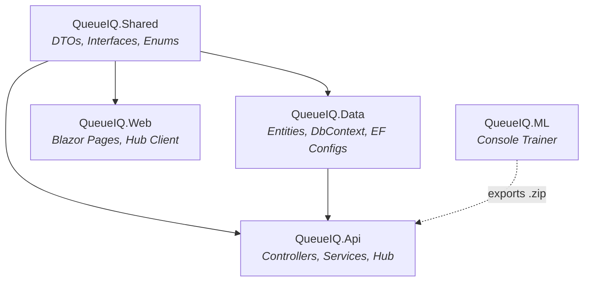
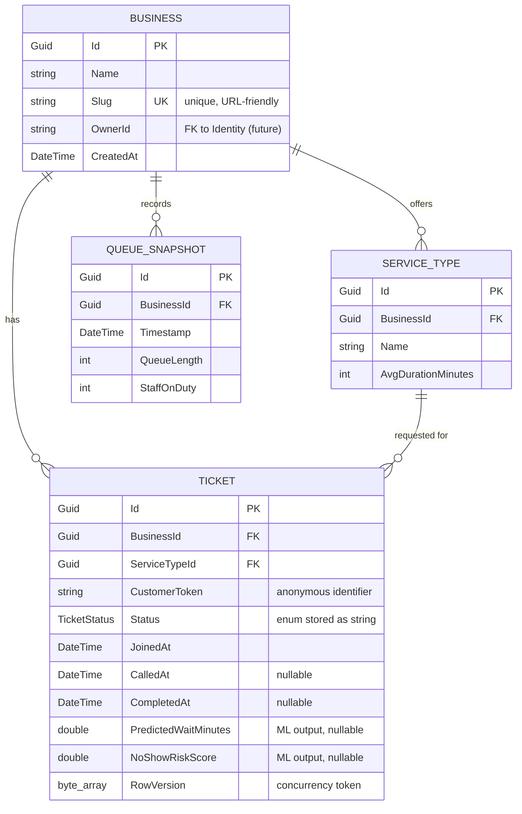
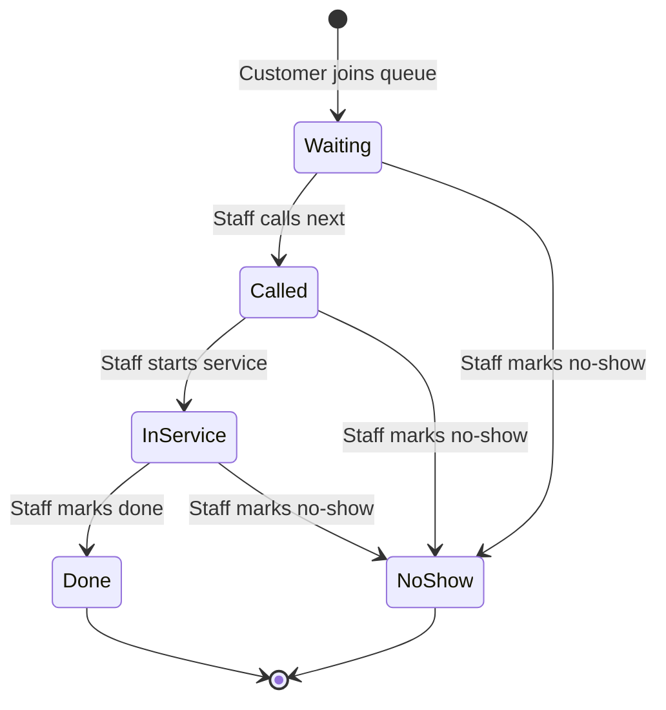
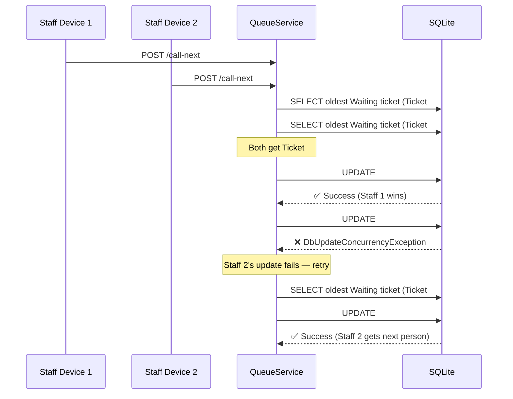

# QueueIQ — System Architecture & Design

> **AI-Powered Real-Time Queue Management System for Small Businesses**
> Built end-to-end with .NET 9 · ASP.NET Core · SignalR · ML.NET · Blazor Server · EF Core

---

## Table of Contents

1. [Executive Summary](#1-executive-summary)
2. [High-Level Architecture](#2-high-level-architecture)
3. [Solution Structure & Project Dependency Graph](#3-solution-structure--project-dependency-graph)
4. [Technology Stack](#4-technology-stack)
5. [Data Model & Entity Relationships](#5-data-model--entity-relationships)
6. [API Layer — RESTful Endpoints](#6-api-layer--restful-endpoints)
7. [Service Layer — Business Logic & State Machine](#7-service-layer--business-logic--state-machine)
8. [Real-Time Infrastructure — SignalR](#8-real-time-infrastructure--signalr)
9. [Machine Learning Pipeline — ML.NET](#9-machine-learning-pipeline--mlnet)
10. [Concurrency & Optimistic Locking](#10-concurrency--optimistic-locking)
11. [Error Handling & Domain Exceptions](#11-error-handling--domain-exceptions)
12. [Observability — Structured Logging](#12-observability--structured-logging)
13. [Frontend — Blazor Server UI](#13-frontend--blazor-server-ui)
14. [Data Pipeline — Synthetic Training Data](#14-data-pipeline--synthetic-training-data)
15. [DevOps & Local Orchestration](#15-devops--local-orchestration)
16. [Request Lifecycle — End-to-End Walkthrough](#16-request-lifecycle--end-to-end-walkthrough)
17. [Key Design Decisions & Trade-offs](#17-key-design-decisions--trade-offs)
18. [File Reference Index](#18-file-reference-index)

---

## 1. Executive Summary

**QueueIQ** is a real-time, multi-tenant queue management system designed for small local businesses — barbershops, clinics, repair shops — that still manage walk-ins with pen and paper. It replaces costly SaaS alternatives (Qminder, Waitwhile) with a lean, self-hostable solution that has a genuine ML differentiator.

### What makes it different from CRUD

| Capability | Implementation |
|---|---|
| **Real-time updates** | SignalR groups isolate traffic per-business; all connected clients see live queue changes instantly |
| **ML-powered predictions** | ML.NET FastTree models predict wait times (regression) and flag no-show risk (binary classification) |
| **Concurrency-safe operations** | EF Core optimistic concurrency with retry logic prevents double-calling in multi-device scenarios |
| **Production-grade patterns** | DTOs at API boundaries, dependency injection, centralized error handling via middleware, structured JSON logging |

### Core User Flows

- **Customer**: Scans a QR code → selects a service → joins the queue → sees live position + ML-predicted wait time → gets notified when called
- **Staff**: Views a three-column dashboard (Waiting / Called / In Service) → calls next customer → marks done — all synced in real time across devices

---

## 2. High-Level Architecture

```
┌─────────────────────────────────────────────────────────────────────────────┐
│                            QueueIQ System                                   │
│                                                                             │
│  ┌──────────────────────┐         ┌──────────────────────────────────────┐  │
│  │   QueueIQ.Web        │         │          QueueIQ.Api                 │  │
│  │   (Blazor Server)    │         │       (ASP.NET Core Web API)         │  │
│  │   Port: 5199         │ HTTP    │         Port: 5088                   │  │
│  │                      ├────────►│                                      │  │
│  │  ┌────────────────┐  │  REST   │  ┌─────────────┐  ┌──────────────┐  │  │
│  │  │ JoinQueue      │  │         │  │ Controllers  │  │  Middleware   │  │  │
│  │  │ CustomerQueue  │  │         │  │  ├ Queue     │  │  └ Exception │  │  │
│  │  │ StaffDashboard │  │         │  │  └ Business  │  │    Handling  │  │  │
│  │  └────────────────┘  │         │  └──────┬──────┘  └──────────────┘  │  │
│  │                      │         │         │                            │  │
│  │  ┌────────────────┐  │ SignalR  │  ┌──────▼──────┐                    │  │
│  │  │ QueueHubService├──┼────────►│  │  Services   │                    │  │
│  │  │ (Client-side)  │  │WebSocket│  │  ├ Queue     │                    │  │
│  │  └────────────────┘  │         │  │  ├ Business  │                    │  │
│  └──────────────────────┘         │  │  ├ Prediction│                    │  │
│                                   │  │  └ Notif.    │                    │  │
│                                   │  └──────┬──────┘                    │  │
│                                   │         │                            │  │
│                                   │  ┌──────▼──────┐  ┌──────────────┐  │  │
│                                   │  │  QueueHub   │  │  ML.NET Pool │  │  │
│                                   │  │  (SignalR)  │  │  ├ WaitTime  │  │  │
│                                   │  │  Groups per │  │  └ NoShow    │  │  │
│                                   │  │  business   │  └──────┬───────┘  │  │
│                                   │  └─────────────┘         │          │  │
│                                   └──────────────┬───────────┘──────────┘  │
│                                                  │                         │
│                                   ┌──────────────▼──────────────┐          │
│                                   │        QueueIQ.Data         │          │
│                                   │    (EF Core + SQLite)       │          │
│                                   │                             │          │
│                                   │  Entities:                  │          │
│                                   │   Business │ ServiceType    │          │
│                                   │   Ticket   │ QueueSnapshot  │          │
│                                   └─────────────────────────────┘          │
│                                                                             │
│  ┌───────────────────┐   ┌──────────────────────────────────────────────┐  │
│  │   data_pipeline/  │   │              QueueIQ.ML                      │  │
│  │   (Python)        │   │       (Console App — Offline Trainer)        │  │
│  │                   │   │                                              │  │
│  │  generate_queue   │──►│  CSV ──► Feature Engineering ──► FastTree    │  │
│  │  _data.py         │   │          ──► Evaluate ──► Export .zip        │  │
│  └───────────────────┘   └──────────────────────────────────────────────┘  │
│                                         │                                   │
│                                         ▼                                   │
│                               models/                                       │
│                               ├── wait_time_model.zip                       │
│                               └── no_show_model.zip                         │
└─────────────────────────────────────────────────────────────────────────────┘
```

### Communication Patterns

| Path | Protocol | Purpose |
|---|---|---|
| Web → API | HTTP REST | CRUD operations (join queue, call next, update status) |
| Web ↔ API | WebSocket (SignalR) | Bidirectional real-time queue state broadcasts |
| API → DB | EF Core (SQLite) | Persistence, queries, concurrency tokens |
| API → ML.NET | In-process | Thread-safe inference via `PredictionEnginePool` |
| ML Trainer → Disk | File I/O | Export trained `.zip` models consumed by the API |

---

## 3. Solution Structure & Project Dependency Graph

```
QueueIQ.sln
│
├── src/
│   ├── QueueIQ.Shared        ← DTOs, Enums, Interfaces (zero dependencies)
│   ├── QueueIQ.Data           ← EF Core entities, DbContext, configurations
│   │                            depends on → QueueIQ.Shared
│   ├── QueueIQ.Api            ← Web API, controllers, services, SignalR hub
│   │                            depends on → QueueIQ.Data, QueueIQ.Shared
│   ├── QueueIQ.Web            ← Blazor Server frontend
│   │                            depends on → QueueIQ.Shared
│   └── QueueIQ.ML             ← Standalone model trainer (console app)
│                                 depends on → Microsoft.ML (no project refs)
│
├── data_pipeline/
│   └── generate_queue_data.py ← Python synthetic data generator
│
├── models/
│   ├── wait_time_model.zip    ← Trained regression model
│   └── no_show_model.zip      ← Trained classification model
│
├── historical_queue_data.csv   ← ~4,600 synthetic training records
├── start-queueiq.ps1          ← PowerShell orchestrator (boots API + Web)
├── test-concurrency.ps1        ← Concurrency test script
└── queueiq-landing.html        ← Static landing page
```

### Dependency Direction (Clean Architecture)



> **Design rationale**: `QueueIQ.Shared` sits at the base with zero project dependencies, containing only contracts (interfaces, DTOs, enums). This allows both the API and the Web frontend to share the same type definitions without coupling either to EF Core entities or implementation details.

---

## 4. Technology Stack

| Layer | Technology | Version | Purpose |
|---|---|---|---|
| **Runtime** | .NET 9 | `net9.0` | All C# projects target .NET 9 |
| **API Framework** | ASP.NET Core Web API | 9.0 | RESTful controllers with JSON serialization |
| **Real-Time** | SignalR | 9.0 (server) / 10.0.9 (client) | WebSocket-based push notifications via groups |
| **ORM** | Entity Framework Core | 9.x | Code-first with Fluent API configurations |
| **Database** | SQLite | via `Microsoft.EntityFrameworkCore.Sqlite` | Local dev database; swappable to SQL Server for production |
| **ML Framework** | ML.NET | 5.0.0 | FastTree regression & binary classification |
| **ML Integration** | Microsoft.Extensions.ML | 5.0.0 | Thread-safe `PredictionEnginePool` for ASP.NET Core |
| **Frontend** | Blazor Server | 9.0 (Interactive Server) | Server-rendered Razor components with real-time interactivity |
| **Logging** | Serilog | 10.0.0 | Structured JSON logging to console + rolling file |
| **API Docs** | Swashbuckle (Swagger) | 7.x | OpenAPI spec generation + Swagger UI |
| **Data Pipeline** | Python 3 (pandas, numpy) | — | Synthetic historical data generation |

---

## 5. Data Model & Entity Relationships

### Entity-Relationship Diagram



### Key Design Choices

| Decision | Rationale |
|---|---|
| **Slug as unique business identifier** | Enables clean customer-facing URLs (e.g., `/join/joes-barbershop`) without exposing GUIDs. Unique index enforced at the DB level. |
| **CustomerToken (not a user account)** | Customers remain anonymous — no registration friction. Token is auto-generated server-side if not provided. |
| **TicketStatus stored as string** | `HasConversion<string>()` in EF configuration makes the database human-readable for debugging. |
| **RowVersion as byte[] concurrency token** | SQLite lacks native `rowversion`; a manually-bumped byte array provides optimistic concurrency control. |
| **Position calculated at query time** | Avoids stale stored positions — recalculated as `COUNT(tickets WHERE JoinedAt < mine AND Status == Waiting) + 1`. |
| **ML fields nullable** | `PredictedWaitMinutes` and `NoShowRiskScore` are populated only when the ML service is available; graceful degradation to naive averages otherwise. |

### Database Indexes

| Index | Columns | Purpose |
|---|---|---|
| `IX_Ticket_BusinessId_Status` | `BusinessId`, `Status` (composite) | Optimizes the primary query: "all Waiting tickets for business X" |
| `IX_Ticket_CustomerToken` | `CustomerToken` | Fast customer position lookups by token |
| `IX_Business_Slug` | `Slug` (unique) | URL-based business resolution |
| `IX_QueueSnapshot_BusinessId_Timestamp` | `BusinessId`, `Timestamp` (composite) | Time-range analytics and ML training data export |

---

## 6. API Layer — RESTful Endpoints

The API uses controller-based routing with two controllers:

### QueueController — Core Queue Operations

| Method | Route | Audience | Description |
|---|---|---|---|
| `POST` | `/api/businesses/{slug}/queue` | Customer | Join the queue for a business |
| `GET` | `/api/businesses/{slug}/queue` | Staff | Get all active tickets in the queue |
| `POST` | `/api/businesses/{slug}/queue/call-next` | Staff | Call the next waiting customer |
| `PATCH` | `/api/queue/tickets/{ticketId}/status` | Staff | Update ticket status (e.g., Called → InService) |
| `GET` | `/api/queue/tickets/{ticketId}/position` | Customer | Get current position and estimated wait |

### BusinessesController — Business Management

| Method | Route | Description |
|---|---|---|
| `GET` | `/api/businesses/{slug}` | Get business by slug |
| `POST` | `/api/businesses` | Create a new business |
| `PUT` | `/api/businesses/{slug}` | Update business details |
| `POST` | `/api/businesses/{slug}/service-types` | Add a service type |
| `GET` | `/api/businesses/{slug}/service-types` | List service types |

### API Conventions

- **JSON enum serialization**: Enums are serialized as strings (e.g., `"Waiting"` not `0`) via `JsonStringEnumConverter`
- **DTO boundaries**: EF entities are never exposed directly — all responses use records from `QueueIQ.Shared.DTOs`
- **Swagger UI**: Available at `http://localhost:5088/swagger` in development mode
- **CORS**: Configured to allow the Blazor Server frontend (different port) with credentials support for SignalR

---

## 7. Service Layer — Business Logic & State Machine

### Service Architecture

```
┌─────────────────────────────────────────────────────────────────┐
│                     Dependency Injection                         │
│                                                                  │
│  All services registered as Scoped (one instance per HTTP req)  │
│                                                                  │
│  IQueueService              → QueueService                      │
│  IBusinessService           → BusinessService                   │
│  IQueueNotificationService  → QueueNotificationService          │
│  IPredictionService         → PredictionService                 │
└─────────────────────────────────────────────────────────────────┘
```

### QueueService — The Heart of QueueIQ

The `QueueService` implements the core business logic. The most critical design element is the **ticket state machine**:



**State transitions are enforced server-side** via a whitelist dictionary:

```csharp
private static readonly Dictionary<TicketStatus, HashSet<TicketStatus>> ValidTransitions = new()
{
    [TicketStatus.Waiting]   = [TicketStatus.Called, TicketStatus.NoShow],
    [TicketStatus.Called]    = [TicketStatus.InService, TicketStatus.NoShow],
    [TicketStatus.InService] = [TicketStatus.Done, TicketStatus.NoShow],
    [TicketStatus.Done]      = [],   // Terminal
    [TicketStatus.NoShow]    = [],   // Terminal
};
```

Any invalid transition (e.g., `Done → Waiting`) throws an `InvalidStatusTransitionException` caught by the middleware.

### PredictionService — ML.NET Inference Wrapper

Wraps the thread-safe `PredictionEnginePool<TInput, TOutput>` for both models:

1. **Constructs a `QueueInput`** from the current context (service type, queue length, time of day, staff count)
2. **Maps C# `DayOfWeek` → Python `weekday()`** to match training data conventions
3. **Falls back to naive averages** if ML inference fails (graceful degradation):
   ```
   naiveWait = (queueLength + 1) × avgServiceDuration / staffOnDuty
   noShowRisk = 5% (base rate)
   ```

### QueueNotificationService — SignalR Broadcaster

Decoupled from `QueueService` to avoid circular dependencies. When the queue mutates, this service:
1. Resolves the business slug from the DB
2. Re-queries the full active queue state
3. Broadcasts to the appropriate SignalR group

---

## 8. Real-Time Infrastructure — SignalR

### Architecture

```
                    ┌──────────────────────────────┐
                    │         QueueHub             │
                    │    Hub<IQueueHubClient>      │
                    │                              │
                    │  Groups:                     │
                    │   "queue-joes-barbershop"    │
                    │   "queue-main-st-clinic"     │
                    │   "queue-fast-fix-auto"      │
                    └──────────────┬───────────────┘
                                   │
              ┌────────────────────┼────────────────────┐
              ▼                    ▼                     ▼
    ┌──────────────┐    ┌──────────────┐     ┌──────────────┐
    │  Staff iPad  │    │  Customer    │     │  Staff       │
    │  Dashboard   │    │  Phone      │     │  Desktop     │
    └──────────────┘    └──────────────┘     └──────────────┘
```

### Strongly-Typed Hub Client

The `IQueueHubClient` interface enforces compile-time safety on all broadcasts:

| Method | Payload | Trigger |
|---|---|---|
| `QueueUpdated(IEnumerable<TicketDto>)` | Full queue snapshot | Any queue mutation |
| `TicketCalled(TicketDto)` | Single ticket | Staff calls next |
| `PositionUpdated(QueuePositionDto)` | Position data | Customer position change |

### Multi-Tenancy via Groups

- Group naming convention: `queue-{business-slug}`
- Clients join a group when navigating to a business page (`JoinBusinessQueue`)
- Clients leave the group when navigating away (`LeaveBusinessQueue`)
- **Key benefit**: Business A's queue updates never leak to Business B's subscribers

### Client-Side Connection (Blazor)

`QueueHubService` in the Web project manages the full SignalR lifecycle:
- Builds a `HubConnection` with automatic reconnect
- Wires up `On<T>` handlers that fire C# events
- Components subscribe to events (e.g., `OnQueueUpdated`) and call `StateHasChanged()`

---

## 9. Machine Learning Pipeline — ML.NET

### Pipeline Overview

```
┌──────────────┐    ┌──────────────┐    ┌──────────────────┐    ┌─────────────┐
│   Python     │    │   ML.NET     │    │    API Runtime    │    │  Blazor UI  │
│   Data Gen   │──►│   Trainer    │──►│  PredictionPool   │──►│  Dashboard  │
│              │    │  (Console)   │    │  (Thread-safe)    │    │             │
│ 180 days     │    │ FastTree     │    │ Per-request       │    │ Est. wait   │
│ ~4,600 rows  │    │ Train/Test   │    │ inference         │    │ No-show     │
│              │    │ 80/20 split  │    │                   │    │ risk badge  │
└──────────────┘    └──────────────┘    └───────────────────┘    └─────────────┘
```

### Two Models, One Input Schema

Both models share the same input feature vector (`QueueInput`):

| Feature | Type | Source |
|---|---|---|
| `ServiceType` | `string` | One-hot encoded categorical |
| `AvgServiceDurationMins` | `float` | From the business's service type definition |
| `DayOfWeek` | `float` | 0–6 (Python convention: Mon=0) |
| `HourOfDay` | `float` | 0–23 |
| `QueueLengthAtJoin` | `float` | Count of people ahead when joining |
| `StaffOnDuty` | `float` | Number of staff currently working |

### Model 1: Wait Time Prediction (Regression)

| Detail | Value |
|---|---|
| **Algorithm** | FastTree Regression (gradient-boosted decision trees) |
| **Label** | `ActualWaitMinutes` |
| **Hyperparameters** | 100 trees, 20 leaves, learning rate 0.2, min 10 examples/leaf |
| **Output** | `WaitTimePrediction.PredictedWaitMinutes` (Score column) |

### Model 2: No-Show Risk (Binary Classification)

| Detail | Value |
|---|---|
| **Algorithm** | FastTree Binary Classification |
| **Label** | `IsNoShow` (boolean) |
| **Extra Feature** | `ActualWaitMinutes` included — longer waits correlate with higher no-show probability |
| **Output** | `NoShowPrediction.IsNoShow` (label) + `Probability` (0.0–1.0 confidence) |

### Feature Engineering Pipeline

```
ServiceType ──► OneHotEncoding ──► ServiceTypeEncoded ─┐
AvgServiceDurationMins ────────────────────────────────┤
DayOfWeek ─────────────────────────────────────────────┤──► Concatenate ──► "Features"
HourOfDay ─────────────────────────────────────────────┤
QueueLengthAtJoin ─────────────────────────────────────┤
StaffOnDuty ───────────────────────────────────────────┘
```

### Integration with the API

- Models are exported as `.zip` files to the `models/` directory
- The API loads them via `PredictionEnginePool` with `watchForChanges: true` — hot-reloading when the model files update
- `PredictionEnginePool` is thread-safe (unlike raw `PredictionEngine`), designed for high-throughput web API workloads

---

## 10. Concurrency & Optimistic Locking

### The Problem

Multiple staff devices (e.g., two iPads at the counter) could simultaneously hit "Call Next" and double-call the same ticket.

### The Solution: Optimistic Concurrency with Retry



### Implementation Details

1. **`RowVersion` byte array** on every `Ticket` entity, configured as `.IsConcurrencyToken()` in EF Core
2. **Manual bump**: `ticket.RowVersion = Guid.NewGuid().ToByteArray()` on every mutation
3. **Retry loop**: `CallNextAsync` retries up to 3 times on `DbUpdateConcurrencyException`, detaching the stale entity between attempts
4. **Terminal failure**: After 3 retries, throws `ConcurrencyConflictException` (HTTP 409)

---

## 11. Error Handling & Domain Exceptions

### Exception Hierarchy

```
Exception
  └── DomainException (base, HTTP 400)
        ├── NotFoundException (HTTP 404)
        │     "Business with identifier 'xyz' was not found."
        ├── InvalidStatusTransitionException (HTTP 400)
        │     "Cannot transition ticket from 'Done' to 'Waiting'."
        ├── ConcurrencyConflictException (HTTP 409)
        │     "The record was modified by another request."
        └── SlugConflictException (HTTP 409)
              "The slug 'joes-barbershop' is already in use."
```

### Centralized Middleware

`ApiExceptionMiddleware` wraps the entire pipeline:

```
Request ──► ApiExceptionMiddleware ──► Controllers ──► Services ──► DB
                     │
                     ├── DomainException? → Structured JSON with correct HTTP status
                     └── Unhandled?       → 500 + generic message (no leak of internals)
```

**Response format:**
```json
{
  "status": 404,
  "message": "Business with identifier 'nonexistent' was not found.",
  "timestamp": "2026-06-28T14:30:00Z"
}
```

> **Design rationale**: Controllers stay clean and focused on their happy path. They never need try/catch blocks — domain exceptions bubble up naturally and the middleware maps them to the correct HTTP status codes.

---

## 12. Observability — Structured Logging

### Serilog Configuration

Both the API and Web projects use identical Serilog setups:

| Sink | Format | Path |
|---|---|---|
| Console | Human-readable | stdout |
| Rolling File | Compact JSON (`CompactJsonFormatter`) | `logs/api-log-{Date}.json` / `logs/web-log-{Date}.json` |

### Structured Log Properties

Key operations produce structured log entries with named properties:

```
Ticket {TicketId} created for business {BusinessId}, service '{ServiceName}'. Wait: {Wait:F1}m, Risk: {Risk:P1}
Ticket {TicketId} called for business {BusinessId}
Ticket {TicketId} status changed to {Status}
Concurrency conflict calling next ticket for business {BusinessId}. Retrying...
Connection {ConnectionId} joined group {GroupName}
```

These properties are machine-parseable in the JSON log files, enabling future integration with log aggregation tools (ELK, Azure Monitor, etc.).

---

## 13. Frontend — Blazor Server UI

### Page Architecture

| Route | Component | Render Mode | Purpose |
|---|---|---|---|
| `/join/{Slug}` | `JoinQueue.razor` | Interactive Server | Customer selects a service and joins the queue |
| `/queue/{Slug}/{TicketId}` | `CustomerQueue.razor` | Interactive Server | Customer sees live position, wait estimate, and status |
| `/staff/{Slug}` | `StaffDashboard.razor` | Interactive Server | Staff manages queue in a 3-column kanban layout |

### Staff Dashboard — Three-Column Layout

```
┌──────────────────────────────────────────────────────────┐
│  Staff Dashboard — Live Queue for joes-barbershop        │
│                                        [Call Next]       │
├──────────────────┬──────────────────┬────────────────────┤
│    WAITING (3)   │    CALLED (1)    │  IN SERVICE (2)    │
│                  │                  │                    │
│  ┌────────────┐  │  ┌────────────┐  │  ┌────────────┐   │
│  │ abc123     │  │  │ def456     │  │  │ ghi789     │   │
│  │ Haircut    │  │  │ Beard Trim │  │  │ Buzz Cut   │   │
│  │ Est: 22min │  │  │            │  │  │            │   │
│  │ Risk: 5%   │  │  │[Start Svc] │  │  │[Mark Done] │   │
│  └────────────┘  │  └────────────┘  │  └────────────┘   │
│  ┌────────────┐  │                  │  ┌────────────┐   │
│  │ jkl012     │  │                  │  │ mno345     │   │
│  │ Haircut+   │  │                  │  │ Haircut    │   │
│  │ Est: 35min │  │                  │  │            │   │
│  │ Risk: 42%  │  │                  │  │[Mark Done] │   │
│  │ ⚠ HIGH     │  │                  │  └────────────┘   │
│  └────────────┘  │                  │                    │
└──────────────────┴──────────────────┴────────────────────┘
```

### Customer Queue — Live Position Tracking

The customer view adapts based on `TicketStatus`:

| Status | Display |
|---|---|
| **Waiting** | Large position number + ML-predicted wait time + "This screen updates automatically" |
| **Called** | Pulsing green indicator + "You're Next! Please head to the counter." |
| **InService** | Scissors icon + "You are currently being served." |
| **Done** | Checkmark + "All Done! Thanks for visiting." |

### Real-Time Update Flow (Blazor ↔ SignalR)

```
QueueHub broadcasts "QueueUpdated" to group
       │
       ▼
QueueHubService.OnQueueUpdated event fires
       │
       ▼
Component handler updates _queue / _position
       │
       ▼
InvokeAsync(StateHasChanged) → Blazor re-renders
```

---

## 14. Data Pipeline — Synthetic Training Data

### Python Data Generator (`data_pipeline/generate_queue_data.py`)

Generates **~4,600 realistic queue records** simulating 180 days (6 months) of a barbershop:

| Parameter | Value |
|---|---|
| Business hours | 9 AM – 7 PM |
| Service types | Haircut (50%), Buzz Cut (20%), Beard Trim (15%), Haircut + Beard (15%) |
| Staffing | 2 staff weekday mornings, 3 on weekday evenings & weekends |
| Arrival rates | Poisson-distributed; higher on weekends (2×), lunch rush (1.2×), evening rush (1.5×) |

### No-Show Probability Model

No-show probability increases with wait time, mirroring real-world behavior:

| Wait Time | Added Probability |
|---|---|
| < 30 min | 2% base |
| 30–60 min | +5% |
| 60–90 min | +15% |
| > 90 min | +30% |

### Output

- `historical_queue_data.csv` — shuffled, ready for ML.NET consumption
- Schema: `ServiceType, AvgServiceDurationMins, DayOfWeek, HourOfDay, QueueLengthAtJoin, StaffOnDuty, ActualWaitMinutes, IsNoShow`

---

## 15. DevOps & Local Orchestration

### `start-queueiq.ps1` — Unified Startup

A custom PowerShell orchestrator that:

1. **Boots both processes** (`dotnet run` for API and Web) as background processes
2. **Streams interleaved logs** with color-coded prefixes: `[API]` in magenta, `[WEB]` in green
3. **Handles graceful shutdown** via `Ctrl+C` → `finally` block kills both processes

### `test-concurrency.ps1` — Concurrency Validation

Automates the concurrency test:

1. Fetches a business's service type ID
2. Joins the queue twice (creates 2 tickets)
3. Fires two **concurrent** `call-next` requests via `Start-Job`
4. Verifies both calls succeed with **different** ticket IDs (no double-call)

### Ports

| Service | Port | URL |
|---|---|---|
| API (HTTP) | 5088 | `http://localhost:5088` |
| API (Swagger) | 5088 | `http://localhost:5088/swagger` |
| Web (Blazor) | 5199 | `http://localhost:5199` |
| SignalR Hub | 5088 | `ws://localhost:5088/hubs/queue` |

---

## 16. Request Lifecycle — End-to-End Walkthrough

### Scenario: Customer Joins the Queue

```
Customer scans QR code → opens /join/joes-barbershop
       │
       ▼
1. JoinQueue.razor loads → GET /api/businesses/joes-barbershop
   → BusinessService.GetBySlugAsync() → returns BusinessDto with service types
       │
       ▼
2. Customer selects "Haircut" → clicks "Join Queue"
   → POST /api/businesses/joes-barbershop/queue
     Body: { "serviceTypeId": "guid-here" }
       │
       ▼
3. QueueController.JoinQueue()
   → Resolves business by slug
   → Calls QueueService.JoinQueueAsync()
       │
       ▼
4. QueueService.JoinQueueAsync()
   ├── Validates business exists
   ├── Validates service type exists & belongs to business
   ├── Creates Ticket entity (Status: Waiting, JoinedAt: now)
   ├── Calculates queue position
   ├── Calls PredictionService.PredictAsync()
   │     ├── Constructs QueueInput (service type, queue length, day/hour, staff)
   │     ├── WaitTimePool.Predict() → 22.3 minutes
   │     └── NoShowPool.Predict()  → 5.2% probability
   ├── Sets ticket.PredictedWaitMinutes = 22.3
   ├── Sets ticket.NoShowRiskScore = 0.052
   ├── Saves to database
   └── Calls NotificationService.NotifyQueueUpdatedAsync()
       │
       ▼
5. QueueNotificationService
   ├── Resolves business slug
   ├── Re-queries full active queue
   └── Broadcasts via SignalR: HubContext.Clients.Group("queue-joes-barbershop").QueueUpdated(queue)
       │
       ▼
6. All connected clients receive the update
   ├── StaffDashboard.razor → HandleQueueUpdated() → refreshes 3-column view
   └── Other CustomerQueue.razor instances → update their positions
       │
       ▼
7. API returns 201 Created with TicketDto
   → JoinQueue.razor navigates to /queue/joes-barbershop/{ticketId}
   → CustomerQueue.razor shows "Position: 3, Est. Wait: 22 min"
```

---

## 17. Key Design Decisions & Trade-offs

| Decision | Why | Trade-off |
|---|---|---|
| **Monolith, not microservices** | Solo portfolio project; a well-structured monolith is more appropriate than over-engineered distributed architecture | Not independently deployable per service |
| **SQLite for local dev** | Zero-setup, file-based database; EF Core abstraction makes provider swap painless | No concurrent write performance at scale (production would use SQL Server) |
| **Blazor Server over React** | Deepens the .NET story end-to-end; Blazor Server itself runs on SignalR (meta-talking point) | Requires persistent server connection per client; no offline capability |
| **Separate ML trainer (console app)** | Decouples training from serving; can retrain on fresh data without touching the API | Extra project to maintain; manual step to copy `.zip` files |
| **Full queue broadcast (not deltas)** | Simpler consistency model — clients always have a complete snapshot | Higher bandwidth per update; acceptable at small-business scale |
| **Anonymous customers (no auth)** | Eliminates registration friction for walk-in customers | No persistent customer history across visits |
| **Scoped DI lifetime for services** | Matches EF Core's `DbContext` lifetime (one per HTTP request) | Cannot share state across requests (by design) |
| **Typed SignalR hub** | Compile-time safety on all broadcast method names | Slightly more boilerplate than untyped `.SendAsync()` |
| **Slug-based routing** | Human-readable URLs that work in QR codes | Requires uniqueness enforcement and slug sanitization logic |

---

## 18. File Reference Index

### API Project (`src/QueueIQ.Api/`)

| File | Purpose |
|---|---|
| [Program.cs](file:///c:/Users/Joseph/Documents/QueueIQ/src/QueueIQ.Api/Program.cs) | Application entry point — DI registration, middleware pipeline, CORS, ML model loading |
| [QueueController.cs](file:///c:/Users/Joseph/Documents/QueueIQ/src/QueueIQ.Api/Controllers/QueueController.cs) | Queue CRUD endpoints (join, call-next, update status, get position) |
| [BusinessesController.cs](file:///c:/Users/Joseph/Documents/QueueIQ/src/QueueIQ.Api/Controllers/BusinessesController.cs) | Business management CRUD endpoints |
| [QueueService.cs](file:///c:/Users/Joseph/Documents/QueueIQ/src/QueueIQ.Api/Services/QueueService.cs) | Core queue logic — state machine, concurrency, position calculation |
| [BusinessService.cs](file:///c:/Users/Joseph/Documents/QueueIQ/src/QueueIQ.Api/Services/BusinessService.cs) | Business CRUD with slug generation and uniqueness enforcement |
| [PredictionService.cs](file:///c:/Users/Joseph/Documents/QueueIQ/src/QueueIQ.Api/Services/PredictionService.cs) | ML.NET inference wrapper with graceful fallback |
| [QueueNotificationService.cs](file:///c:/Users/Joseph/Documents/QueueIQ/src/QueueIQ.Api/Services/QueueNotificationService.cs) | SignalR broadcast implementation |
| [QueueHub.cs](file:///c:/Users/Joseph/Documents/QueueIQ/src/QueueIQ.Api/Hubs/QueueHub.cs) | SignalR hub — group join/leave, multi-tenant isolation |
| [ApiExceptionMiddleware.cs](file:///c:/Users/Joseph/Documents/QueueIQ/src/QueueIQ.Api/Middleware/ApiExceptionMiddleware.cs) | Centralized error handling middleware |
| [DomainExceptions.cs](file:///c:/Users/Joseph/Documents/QueueIQ/src/QueueIQ.Api/Exceptions/DomainExceptions.cs) | Custom exception hierarchy (404, 400, 409) |
| [PredictionModels.cs](file:///c:/Users/Joseph/Documents/QueueIQ/src/QueueIQ.Api/Models/PredictionModels.cs) | ML.NET input/output schema classes (API-side) |

### Data Project (`src/QueueIQ.Data/`)

| File | Purpose |
|---|---|
| [QueueIQDbContext.cs](file:///c:/Users/Joseph/Documents/QueueIQ/src/QueueIQ.Data/QueueIQDbContext.cs) | EF Core DbContext — auto-discovers configurations from assembly |
| [Business.cs](file:///c:/Users/Joseph/Documents/QueueIQ/src/QueueIQ.Data/Entities/Business.cs) | Business entity with navigation properties |
| [Ticket.cs](file:///c:/Users/Joseph/Documents/QueueIQ/src/QueueIQ.Data/Entities/Ticket.cs) | Ticket entity — full lifecycle tracking + ML fields + concurrency token |
| [ServiceType.cs](file:///c:/Users/Joseph/Documents/QueueIQ/src/QueueIQ.Data/Entities/ServiceType.cs) | Service type entity (e.g., "Haircut", 30 min average) |
| [QueueSnapshot.cs](file:///c:/Users/Joseph/Documents/QueueIQ/src/QueueIQ.Data/Entities/QueueSnapshot.cs) | Point-in-time analytics snapshot |
| [TicketConfiguration.cs](file:///c:/Users/Joseph/Documents/QueueIQ/src/QueueIQ.Data/Configurations/TicketConfiguration.cs) | Fluent API — concurrency token, indexes, FK cascade rules |
| [BusinessConfiguration.cs](file:///c:/Users/Joseph/Documents/QueueIQ/src/QueueIQ.Data/Configurations/BusinessConfiguration.cs) | Fluent API — unique slug index, property constraints |
| [ServiceTypeConfiguration.cs](file:///c:/Users/Joseph/Documents/QueueIQ/src/QueueIQ.Data/Configurations/ServiceTypeConfiguration.cs) | Fluent API — FK to Business with cascade delete |
| [QueueSnapshotConfiguration.cs](file:///c:/Users/Joseph/Documents/QueueIQ/src/QueueIQ.Data/Configurations/QueueSnapshotConfiguration.cs) | Fluent API — composite index for time-range queries |

### Shared Project (`src/QueueIQ.Shared/`)

| File | Purpose |
|---|---|
| [TicketDto.cs](file:///c:/Users/Joseph/Documents/QueueIQ/src/QueueIQ.Shared/DTOs/TicketDto.cs) | TicketDto, CreateTicketDto, UpdateTicketStatusDto, QueuePositionDto |
| [BusinessDto.cs](file:///c:/Users/Joseph/Documents/QueueIQ/src/QueueIQ.Shared/DTOs/BusinessDto.cs) | BusinessDto, CreateBusinessDto, UpdateBusinessDto |
| [ServiceTypeDto.cs](file:///c:/Users/Joseph/Documents/QueueIQ/src/QueueIQ.Shared/DTOs/ServiceTypeDto.cs) | ServiceTypeDto, CreateServiceTypeDto |
| [TicketStatus.cs](file:///c:/Users/Joseph/Documents/QueueIQ/src/QueueIQ.Shared/Enums/TicketStatus.cs) | Enum: Waiting, Called, InService, Done, NoShow |
| [IQueueService.cs](file:///c:/Users/Joseph/Documents/QueueIQ/src/QueueIQ.Shared/Interfaces/IQueueService.cs) | Core queue operations contract |
| [IBusinessService.cs](file:///c:/Users/Joseph/Documents/QueueIQ/src/QueueIQ.Shared/Interfaces/IBusinessService.cs) | Business management contract |
| [IPredictionService.cs](file:///c:/Users/Joseph/Documents/QueueIQ/src/QueueIQ.Shared/Interfaces/IPredictionService.cs) | ML prediction contract |
| [IQueueNotificationService.cs](file:///c:/Users/Joseph/Documents/QueueIQ/src/QueueIQ.Shared/Interfaces/IQueueNotificationService.cs) | Real-time notification contract |
| [IQueueHubClient.cs](file:///c:/Users/Joseph/Documents/QueueIQ/src/QueueIQ.Shared/Interfaces/IQueueHubClient.cs) | Strongly-typed SignalR client interface |

### Web Project (`src/QueueIQ.Web/`)

| File | Purpose |
|---|---|
| [Program.cs](file:///c:/Users/Joseph/Documents/QueueIQ/src/QueueIQ.Web/Program.cs) | Blazor Server entry point — HttpClient, hub service, Serilog |
| [QueueHubService.cs](file:///c:/Users/Joseph/Documents/QueueIQ/src/QueueIQ.Web/Services/QueueHubService.cs) | Client-side SignalR connection manager with C# events |
| [JoinQueue.razor](file:///c:/Users/Joseph/Documents/QueueIQ/src/QueueIQ.Web/Components/Pages/JoinQueue.razor) | Customer service selection + join page |
| [CustomerQueue.razor](file:///c:/Users/Joseph/Documents/QueueIQ/src/QueueIQ.Web/Components/Pages/CustomerQueue.razor) | Customer live position tracking page |
| [StaffDashboard.razor](file:///c:/Users/Joseph/Documents/QueueIQ/src/QueueIQ.Web/Components/Pages/StaffDashboard.razor) | Staff 3-column kanban queue manager |

### ML Project (`src/QueueIQ.ML/`)

| File | Purpose |
|---|---|
| [Program.cs](file:///c:/Users/Joseph/Documents/QueueIQ/src/QueueIQ.ML/Program.cs) | Standalone trainer — load CSV, train FastTree, evaluate, export .zip |
| [QueueInput.cs](file:///c:/Users/Joseph/Documents/QueueIQ/src/QueueIQ.ML/Models/QueueInput.cs) | ML.NET input schema with `[LoadColumn]` annotations |
| [WaitTimePrediction.cs](file:///c:/Users/Joseph/Documents/QueueIQ/src/QueueIQ.ML/Models/WaitTimePrediction.cs) | Regression output: `PredictedWaitMinutes` |
| [NoShowPrediction.cs](file:///c:/Users/Joseph/Documents/QueueIQ/src/QueueIQ.ML/Models/NoShowPrediction.cs) | Classification output: `IsNoShow` + `Probability` |

### Root Files

| File | Purpose |
|---|---|
| [QueueIQ.sln](file:///c:/Users/Joseph/Documents/QueueIQ/QueueIQ.sln) | Visual Studio solution (5 projects) |
| [start-queueiq.ps1](file:///c:/Users/Joseph/Documents/QueueIQ/start-queueiq.ps1) | PowerShell orchestrator — boots API + Web simultaneously |
| [test-concurrency.ps1](file:///c:/Users/Joseph/Documents/QueueIQ/test-concurrency.ps1) | Automated concurrency validation script |
| [generate_queue_data.py](file:///c:/Users/Joseph/Documents/QueueIQ/data_pipeline/generate_queue_data.py) | Python synthetic training data generator |

---

*Document generated from full codebase analysis — QueueIQ, June 2026*
